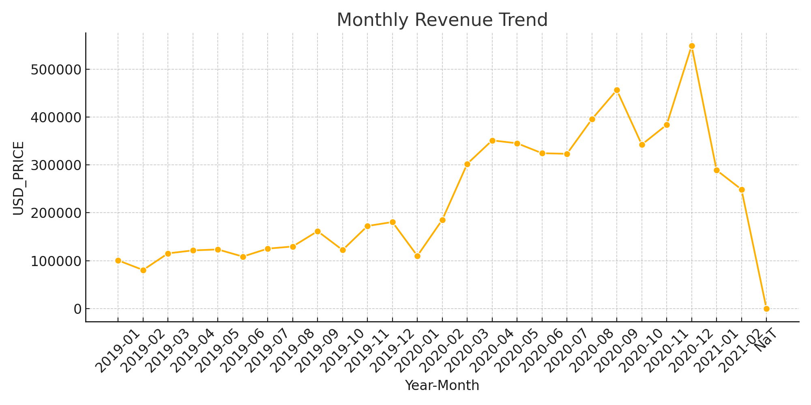
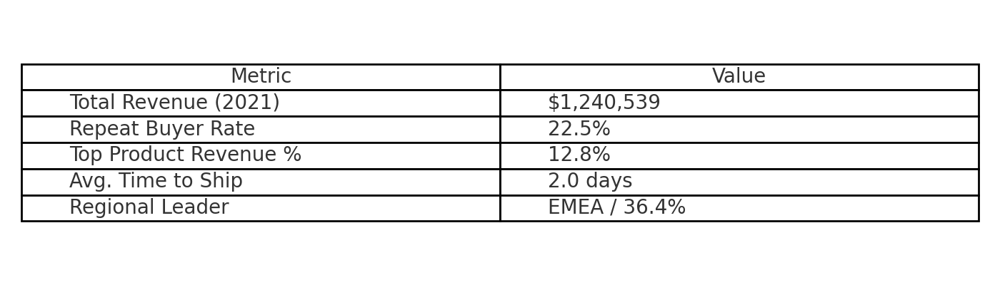
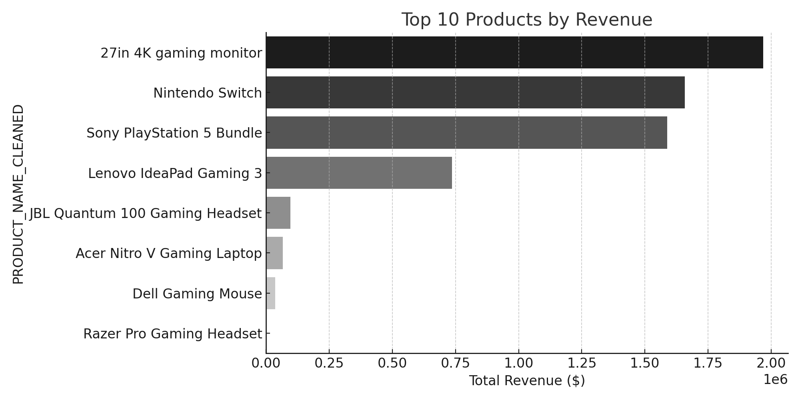
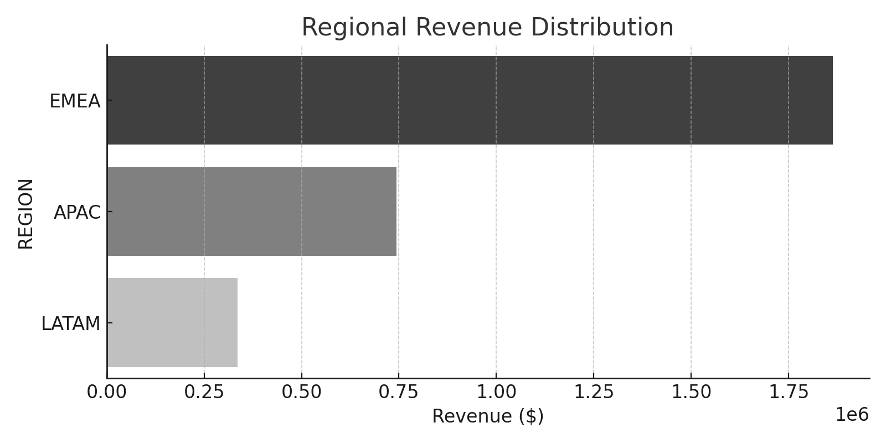

# Electronic Market E-Commerce Analysis

## Project Purpose
This project explores sales, customer, and product performance data from an electronic market e-commerce platform operating since 2019. It uncovers trends in revenue, customer retention, regional performance, and operational efficiency to provide actionable business recommendations.

## Dataset
The data includes order-level transaction details such as:
- Purchase timestamps
- Product names
- Customer IDs
- Regions
- Purchase platforms
- Marketing channels
- Pricing and shipping details

## Tools Used
- Python (Pandas, Matplotlib, Seaborn)
- Jupyter Notebook
- SQL (SQLite-compatible)
- Streamlit (for dashboard app)
- Excel for raw dataset storage

## Key Visuals

### Monthly Sales Trend


### Executive KPI Summary


### Top Products by Revenue


### Regional Revenue Performance


## How to Run This Project

1. Clone this repository.
2. Install dependencies:
```bash
pip install pandas matplotlib seaborn streamlit
```
3. Launch the Jupyter Notebook:
```bash
jupyter notebook notebooks/Electronic_Market_Analysis_FINAL_CLEAN_WITH_LIMITATIONS.ipynb
```
4. Or run the interactive Streamlit dashboard:
```bash
streamlit run app/electronic_market_dashboard_app.py
```

## Business Takeaways
- Mobile and desktop platforms show significant usage imbalance; mobile optimization is recommended.
- A small number of products contribute a large percentage of total revenue, signaling dependency risk.
- Repeat buyer ratio is low; introducing a loyalty program can improve retention.
- APAC and EMEA regions dominate revenue, suggesting strategic marketing in LATAM could expand reach.
- Shipping times are stable; maintaining logistics efficiency is key.


## Hypothetical Business Impact Scenarios

These are estimated business benefits based on data patterns and scenario modeling:

### 1. Improve Repeat Buyer Rate
- **Current Repeat Rate**: 9.5%
- **Target Repeat Rate**: 14.5%
- **Projected Revenue Increase**: $307,563

### 2. Expand LATAM to Match EMEA Share
- **Current LATAM Revenue**: $335,717
- **Target LATAM Revenue**: $1,864,059
- **Potential Growth Opportunity**: $1,528,342

### 3. Reduce Average Time to Ship
- **Current Avg. Time to Ship**: 2.0 days
- **Hypothetical Reduction**: 1 day faster
- **Customer Retention Uplift**: 2%
- **Projected Revenue Impact**: $123,025

These calculations are based on simple, scalable assumptions. They help prioritize initiatives like loyalty programs, regional expansion, and operational efficiency.


## Limitations and Caveats
- This dataset does not include returns, cost of goods sold, or marketing spend.
- Assumes all orders were successfully fulfilled.
- Some platform and channel entries are missing or inconsistently labeled.
- No demographic or campaign-level marketing data available.
- Revenue calculations do not account for discounts or taxes.

